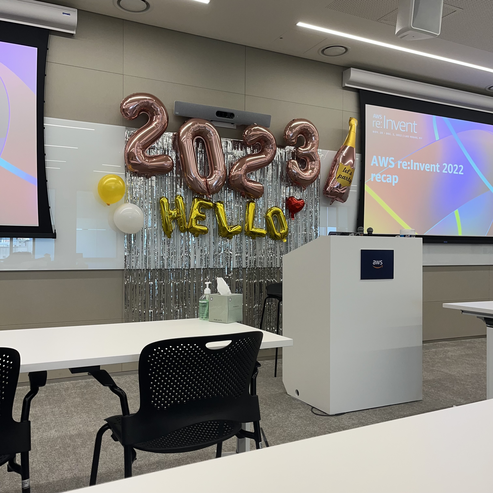

## **AWS re:Invent re:cap for MFG**

2023.01.30 역삼센터필드 AWS코리아

---

<!-- footer: AWS re:Invent re:cap for MFG -->

# **Session 1.**
##### **AWS RE:INVENT - 2022.11.28 ~ 12.02 Las Vegas**

* 전체 오프라인 참가자 약 5만명, 온라인 30만명
**한국에서 약 1700여명 참석**
* 매년 라스베가스에서 **11월 마지막주**에 행사가 치뤄짐
* 보통 Black Friday 다음주에 열리기 때문에 미리가서 쇼핑 하는것도 괜찮은 선택임
* 통상 **5월에 사전등록** 오픈을 하니 올해 많은 관심바람

---

# **Session 2.**
### MFG 고객 사례

**SCM / 스마트엔지니어링 / 스마트 프로덕트 / 탄소중립**

* 하이네켄 - 전반적인 생산 밸런싱 및 청소시기 ML
* UNOX - 오븐 제조업체. 소매 및 체인을 위한 IoT서비스 
* 삼성전자 - 유통/생산 스케줄 조정 및 Smart Things + AIML 고도화

---

# **Session 3.**
### Technical Highlights for MFG

**Zero-ETL / Clean Rooms / Supply Chain / AIML**

* RedShift를 통해서 **Zero-ETL**(Data Warehouse 없이)
* **Apache Spark**와의 연계성을 더욱 강화시켰으니 써보렴
* Data Zone / **Clean Room** 을 사용하면 비지니스 데이터를 효율적으로 분석 및 시각화할 수 있고 협업이 증대됨

---

# **소감**

* GS, SK, 한국타이어 등등의 업체가 참석 했고 AWS 활용을 잘 하고 있음
* 참석하여 Insight를 얻는 것 자체에 의의를 둠
* 점심 안먹고 갈 걸(다양한 핑거푸드, 음료 제공)

